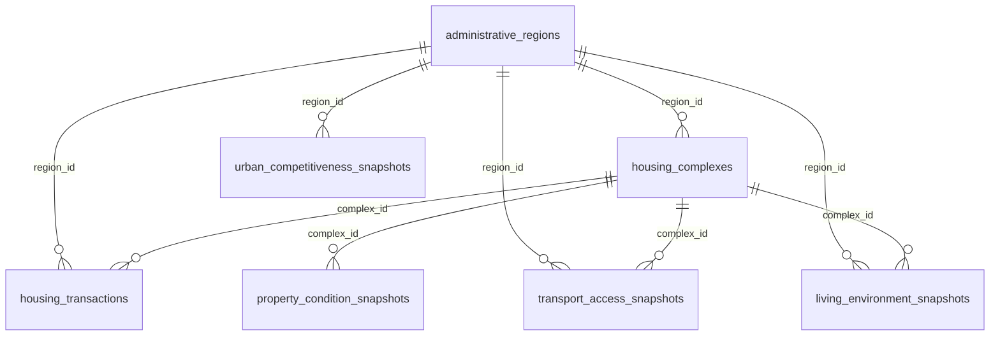

# MySQL 학습용 테이블 구조

최종 업데이트: 2026-06-12

이 문서는 현재 `train --from-db` 학습 경로에서 실제로 사용되는 MySQL 구조만 정리한다. 기준은 `model_training_features` 뷰와 `src/hedonic_house_price/db_training.py`의 학습 reader가 선택하는 컬럼이다.

현재 학습은 개별 테이블을 직접 읽지 않고 `model_training_features` 뷰를 읽는다. 이 뷰는 거래 테이블을 중심으로 행정구역, 단지, 가격요인 snapshot 테이블을 거래월(`deal_yyyymm`) 기준으로 조인한다.

주의: 현재 최고 성능 모델은 MySQL feature 외에 `--floor-stats data/seoul_busan_complex_floor_stats_201007_202606_merged.csv`도 함께 사용한다. 이 파일은 단지별 관측 최고층 보강용 외부 CSV이며 MySQL 테이블은 아니다.

## 사용 구조 요약



## 1. `administrative_regions`

행정구역 기준 테이블이다. 거래, 단지, 지역 단위 snapshot이 모두 이 테이블의 `region_id`를 참조한다.

| 컬럼 | 타입 | 학습 내 역할 |
|---|---|---|
| `region_id` | `BIGINT UNSIGNED` PK | 모든 지역 조인의 기준 키 |
| `city_code` | `VARCHAR(16)` | `seoul`, `busan` 구분. 학습 feature 및 도시별 필터에 사용 |
| `city_name` | `VARCHAR(32)` | 뷰 표시용 |
| `district_name` | `VARCHAR(64)` | 구 단위 feature 및 target encoding 원천 |
| `legal_dong_name` | `VARCHAR(64)` | 법정동 식별 보조 |
| `lawd_cd` | `CHAR(5)` | API 지역코드, 학습 row의 `lawd_cd` |
| `legal_dong_cd` | `CHAR(10)` | 법정동 코드 |
| `region_level` | `ENUM('city','district','legal_dong')` | 행정구역 계층 |
| `is_active` | `TINYINT(1)` | 활성 여부 |

주요 제약:

| 제약 | 내용 |
|---|---|
| `uq_administrative_regions_lawd_cd` | `lawd_cd` 유니크 |
| `uq_administrative_regions_legal_dong_cd` | `legal_dong_cd` 유니크 |
| `chk_administrative_regions_city` | `city_code IN ('seoul', 'busan')` |

## 2. `housing_complexes`

아파트 단지 기준 테이블이다. 학습 feature 자체에는 단지명을 직접 넣지 않지만, 단지 단위 가격요인 snapshot과 좌표 기반 거리 계산의 기준이 된다.

| 컬럼 | 타입 | 학습 내 역할 |
|---|---|---|
| `complex_id` | `BIGINT UNSIGNED` PK | 단지 단위 snapshot 조인 키 |
| `region_id` | `BIGINT UNSIGNED` FK | 행정구역 연결 |
| `property_type` | `ENUM('apartment','officetel','rowhouse')` | 현재 운영 학습은 `apartment`만 사용 |
| `complex_name` | `VARCHAR(255)` | 거래 단지 매칭 및 보강 작업용 |
| `road_address` | `VARCHAR(512)` | 지오코딩 보강용 |
| `jibun_address` | `VARCHAR(512)` | 지오코딩 보강용 |
| `latitude` | `DECIMAL(10,7)` | 학교, 지하철, 버스, 병원, 약국, 공원 거리 계산 기준 |
| `longitude` | `DECIMAL(10,7)` | 학교, 지하철, 버스, 병원, 약국, 공원 거리 계산 기준 |

주요 제약:

| 제약 | 내용 |
|---|---|
| `idx_complexes_region_type_name` | `region_id`, `property_type`, `complex_name` 검색 |
| `idx_complexes_lat_lng` | 좌표 기반 조회 |
| `fk_complexes_region` | `administrative_regions(region_id)` 참조 |

## 3. `housing_transactions`

학습의 중심이 되는 거래 내역 테이블이다. 종속변수 가격과 핵심 거래 feature가 모두 여기서 나온다.

| 컬럼 | 타입 | 학습 내 역할 |
|---|---|---|
| `transaction_id` | `BIGINT UNSIGNED` PK | 학습 row 정렬용 |
| `source_system` | `VARCHAR(64)` | 중복 방지 원천 식별 |
| `source_property_type` | `VARCHAR(64)` | 원천 주택유형 |
| `source_row_hash` | `CHAR(64)` | 중복 적재 방지 |
| `property_type` | `ENUM('apartment','officetel','rowhouse')` | 학습 필터 및 feature. 현재 best 모델은 `apartment` |
| `city_code` | `VARCHAR(16)` | 도시별 학습 필터 및 feature |
| `region_id` | `BIGINT UNSIGNED` FK | 행정구역 및 지역 snapshot 조인 |
| `complex_id` | `BIGINT UNSIGNED` FK nullable | 단지 snapshot 조인 |
| `lawd_cd` | `CHAR(5)` | 지역코드 feature |
| `district_name` | `VARCHAR(64)` | 구 feature 및 target encoding |
| `legal_dong_name` | `VARCHAR(64)` | 법정동 feature 및 target encoding |
| `building_name` | `VARCHAR(255)` | 단지별 최고층 추정 키. 모델 입력 feature로 직접 쓰지는 않음 |
| `house_type` | `VARCHAR(64)` | 세부 주택유형 feature |
| `deal_date` | `DATE` | 거래일, 시간순 validation split 및 정렬 |
| `deal_yyyymm` | `CHAR(6)` | 월 단위 snapshot 조인 및 시간 feature |
| `exclusive_area_m2` | `DECIMAL(10,3)` | 전용면적. `log1p` 변환 |
| `land_area_m2` | `DECIMAL(10,3)` nullable | 대지면적 보조 feature |
| `floor` | `INT` | 층 구간, 상대층수, 최고층 더미 원천 |
| `build_year` | `SMALLINT UNSIGNED` | 거래 시점 연식 구간 원천 |
| `price_manwon` | `INT UNSIGNED` | 가격 원천 |
| `price_krw` | `BIGINT UNSIGNED GENERATED` | `price_manwon * 10000`; 종속변수는 `log(price_krw)` |

주요 제약:

| 제약 | 내용 |
|---|---|
| `uq_transactions_source_hash` | 원천 row 중복 방지 |
| `idx_transactions_city_month` | 도시/월별 학습 조회 |
| `idx_transactions_complex_month` | 단지/월별 snapshot 연결 |
| `fk_transactions_region` | `administrative_regions(region_id)` 참조 |
| `fk_transactions_complex` | `housing_complexes(complex_id)` 참조 |

## 4. `property_condition_snapshots`

집 자체 조건 snapshot이다. `complex_id + snapshot_yyyymm + source_name` 단위로 저장한다.

| 컬럼 | 타입 | 학습 내 역할 |
|---|---|---|
| `snapshot_id` | `BIGINT UNSIGNED` PK | snapshot 식별자 |
| `complex_id` | `BIGINT UNSIGNED` FK | 단지 조인 키 |
| `snapshot_yyyymm` | `CHAR(6)` | 거래월과 동일 월 조인 |
| `source_name` | `VARCHAR(100)` | `transactions_derived`, `kapt_basic_info` 구분 |
| `representative_floor` | `INT` nullable | `kapt_basic_info`일 때 `kapt_max_floor`로 사용 |
| `household_count` | `INT UNSIGNED` nullable | 세대수. `log1p` 변환 |
| `building_count` | `INT UNSIGNED` nullable | 동수. 원본은 직접 쓰지 않고 `household_count / building_count` 계산 |
| `total_parking_spaces` | `INT UNSIGNED` nullable | 총 주차대수. `log1p` 변환 |
| `parking_spaces_per_household` | `DECIMAL(8,3)` nullable | 세대당 주차대수 |
| `has_community_facilities` | `TINYINT(1)` nullable | 편의시설 여부 더미 |

`exclusive_area_m2`, `build_year`도 테이블에는 있으나 학습은 거래 테이블의 `exclusive_area_m2`, `build_year`를 핵심 원천으로 사용한다.

뷰 조인 규칙:

| alias | 조건 | 용도 |
|---|---|---|
| `pcs_tx` | `source_name = 'transactions_derived'` | 거래 기반 파생 집 자체 조건 |
| `pcs_kapt` | `source_name = 'kapt_basic_info'` | KAPT 단지 기본정보 보강 |

`household_count`, `building_count`, `total_parking_spaces`, `parking_spaces_per_household`, `has_community_facilities`는 `COALESCE(pcs_kapt, pcs_tx)`로 KAPT 값을 우선 사용한다.

## 5. `transport_access_snapshots`

교통 접근성 snapshot이다. 단지 단위 값이 있으면 단지 값을 우선하고, 없으면 행정구역 값을 사용한다.

| 컬럼 | 타입 | 학습 내 역할 |
|---|---|---|
| `snapshot_id` | `BIGINT UNSIGNED` PK | snapshot 식별자 |
| `region_id` | `BIGINT UNSIGNED` FK nullable | 지역 단위 조인 키 |
| `complex_id` | `BIGINT UNSIGNED` FK nullable | 단지 단위 조인 키 |
| `snapshot_yyyymm` | `CHAR(6)` | 거래월과 동일 월 조인 |
| `source_name` | `VARCHAR(100)` | 보강 원천명 |
| `radius_m` | `INT UNSIGNED` | 반경 기준 |
| `nearest_subway_distance_m` | `DECIMAL(10,2)` nullable | 지하철역까지 거리. `log1p` 변환 |
| `subway_count_radius` | `INT UNSIGNED` nullable | 반경 내 지하철 수. 구간화 |
| `nearest_bus_stop_distance_m` | `DECIMAL(10,2)` nullable | 버스 정류장까지 거리. `log1p` 변환 |
| `bus_stop_count_radius` | `INT UNSIGNED` nullable | 반경 내 버스 정류장 수. 구간화 |
| `car_intercity_bus_terminal_minutes` | `DECIMAL(8,2)` nullable | 승용차 시외버스터미널 평균접근시간 |
| `car_airport_minutes` | `DECIMAL(8,2)` nullable | 승용차 공항 평균접근시간 |
| `car_rail_station_minutes` | `DECIMAL(8,2)` nullable | 승용차 철도역 평균접근시간 |
| `car_general_hospital_minutes` | `DECIMAL(8,2)` nullable | 승용차 종합병원 평균접근시간 |
| `transit_intercity_bus_terminal_minutes` | `DECIMAL(8,2)` nullable | 대중교통 시외버스터미널 평균접근시간 |
| `transit_airport_minutes` | `DECIMAL(8,2)` nullable | 대중교통 공항 평균접근시간 |
| `transit_rail_station_minutes` | `DECIMAL(8,2)` nullable | 대중교통 철도역 평균접근시간 |
| `transit_general_hospital_minutes` | `DECIMAL(8,2)` nullable | 대중교통 종합병원 평균접근시간 |

주요 제약:

| 제약 | 내용 |
|---|---|
| `chk_transport_scope` | `region_id` 또는 `complex_id` 중 하나는 존재 |
| `uq_transport_complex_snapshot` | 단지/월/source 중복 방지 |
| `uq_transport_region_snapshot` | 지역/월/source 중복 방지 |

## 6. `living_environment_snapshots`

생활, 교육, 자연환경 snapshot이다. 교통 snapshot과 동일하게 단지 값 우선, 없으면 행정구역 값을 사용한다. 항목별로 `source_name`을 나눠 같은 테이블에 저장한다.

| 컬럼 | 타입 | 학습 내 역할 |
|---|---|---|
| `snapshot_id` | `BIGINT UNSIGNED` PK | snapshot 식별자 |
| `region_id` | `BIGINT UNSIGNED` FK nullable | 지역 단위 조인 키 |
| `complex_id` | `BIGINT UNSIGNED` FK nullable | 단지 단위 조인 키 |
| `snapshot_yyyymm` | `CHAR(6)` | 거래월과 동일 월 조인 |
| `source_name` | `VARCHAR(100)` | `school_location`, `academy_nearby_complex_2604`, `healthcare_facility`, `park_standard_data` |
| `radius_m` | `INT UNSIGNED` | 반경 기준 |
| `nearest_elementary_school_distance_m` | `DECIMAL(10,2)` nullable | 초등학교 거리. `log1p` 변환 |
| `nearest_middle_school_distance_m` | `DECIMAL(10,2)` nullable | 중학교 거리. `log1p` 변환 |
| `school_count_radius` | `INT UNSIGNED` nullable | 반경 내 학교 수. 구간화 |
| `academy_count_radius` | `INT UNSIGNED` nullable | 반경 내 학원 수. 구간화 |
| `nearest_hospital_distance_m` | `DECIMAL(10,2)` nullable | 병원 거리. `log1p` 변환 |
| `nearest_pharmacy_distance_m` | `DECIMAL(10,2)` nullable | 약국 거리. `log1p` 변환 |
| `nearest_park_distance_m` | `DECIMAL(10,2)` nullable | 공원 거리. `log1p` 변환 |
| `park_area_total_m2_radius` | `DECIMAL(14,2)` nullable | 반경 내 공원 면적 합계. 공원 존재 더미 및 `log1p` 변환 |

주요 조인 원천:

| source_name | 사용 컬럼 |
|---|---|
| `school_location` | 초등학교 거리, 중학교 거리, 학교 수 |
| `academy_nearby_complex_2604` | 학원 수 |
| `healthcare_facility` | 병원 거리, 약국 거리 |
| `park_standard_data` | 공원 거리, 공원 면적 합계 |

## 7. `urban_competitiveness_snapshots`

도시 경쟁력 snapshot 테이블이다. 현재 학습 reader는 이 테이블에서 `recent_transaction_count`만 읽는다.

| 컬럼 | 타입 | 학습 내 역할 |
|---|---|---|
| `snapshot_id` | `BIGINT UNSIGNED` PK | snapshot 식별자 |
| `region_id` | `BIGINT UNSIGNED` FK | 지역 조인 키 |
| `snapshot_yyyymm` | `CHAR(6)` | 거래월과 동일 월 조인 |
| `source_name` | `VARCHAR(100)` | 보강 원천명 |
| `recent_transaction_count` | `INT UNSIGNED` nullable | 최근 거래량. 개수 구간화 |

현재 학습에서 제외한 도시 경쟁력 컬럼:

| 컬럼 | 제외 이유 |
|---|---|
| `population_count` | 현재 reader가 선택하지 않음 |
| `population_growth_rate` | 현재 reader가 선택하지 않음 |
| `employment_rate` | 현재 reader가 선택하지 않음 |
| `income_level_krw` | 현재 reader가 선택하지 않음 |
| `unsold_housing_count` | 현재 reader가 선택하지 않음 |
| `completed_housing_supply_count` | 현재 reader가 선택하지 않음 |

## 8. `model_training_features` 뷰

학습 코드가 실제로 읽는 중앙 뷰다.

### 학습 reader가 선택하는 핵심 거래 컬럼

| 컬럼 | 원천 |
|---|---|
| `property_type` | `housing_transactions.property_type` |
| `district` | `housing_transactions.district_name` |
| `lawd_cd` | `housing_transactions.lawd_cd` |
| `deal_year` | `YEAR(housing_transactions.deal_date)` |
| `deal_month` | `MONTH(housing_transactions.deal_date)` |
| `deal_day` | `DAYOFMONTH(housing_transactions.deal_date)` |
| `legal_dong` | `housing_transactions.legal_dong_name` |
| `building_name` | `housing_transactions.building_name` |
| `house_type` | `housing_transactions.house_type` |
| `land_area_m2` | `housing_transactions.land_area_m2` |
| `exclusive_area_m2` | `housing_transactions.exclusive_area_m2` |
| `floor` | `housing_transactions.floor` |
| `build_year` | `housing_transactions.build_year` |
| `price_manwon` | `housing_transactions.price_manwon` |

### 학습 reader가 선택하는 가격요인 컬럼

| 구분 | 컬럼 |
|---|---|
| 도시 | `city_code` |
| 집 자체 조건 | `household_count`, `building_count`, `total_parking_spaces`, `parking_spaces_per_household`, `has_community_facilities`, `kapt_max_floor` |
| 교통 접근성 | `nearest_subway_distance_m`, `subway_count_radius`, `nearest_bus_stop_distance_m`, `bus_stop_count_radius`, `car_intercity_bus_terminal_minutes`, `car_airport_minutes`, `car_rail_station_minutes`, `car_general_hospital_minutes`, `transit_intercity_bus_terminal_minutes`, `transit_airport_minutes`, `transit_rail_station_minutes`, `transit_general_hospital_minutes` |
| 생활, 교육, 자연환경 | `nearest_elementary_school_distance_m`, `nearest_middle_school_distance_m`, `school_count_radius`, `academy_count_radius`, `nearest_hospital_distance_m`, `nearest_pharmacy_distance_m`, `nearest_park_distance_m`, `park_area_total_m2_radius` |
| 도시 경쟁력 | `recent_transaction_count` |

`kapt_max_floor`는 optional feature다. complete-case 필터에는 포함되지 않는다.

### complete-case 필터

기본 DB 학습(`train --from-db`)은 아래 컬럼 중 하나라도 `NULL`이면 해당 거래 row를 학습에서 제외한다.

```text
city_code
household_count
building_count
total_parking_spaces
parking_spaces_per_household
has_community_facilities
nearest_subway_distance_m
subway_count_radius
nearest_bus_stop_distance_m
bus_stop_count_radius
car_intercity_bus_terminal_minutes
car_airport_minutes
car_rail_station_minutes
car_general_hospital_minutes
transit_intercity_bus_terminal_minutes
transit_airport_minutes
transit_rail_station_minutes
transit_general_hospital_minutes
nearest_elementary_school_distance_m
nearest_middle_school_distance_m
school_count_radius
academy_count_radius
nearest_hospital_distance_m
nearest_pharmacy_distance_m
nearest_park_distance_m
park_area_total_m2_radius
recent_transaction_count
```

`--allow-missing-factors`를 사용하면 이 필터를 해제할 수 있지만, 현재 best 모델은 complete-case 기준의 3개년 모델을 선택했다.

## 제외된 스키마/컬럼

현재 학습 구조 문서에서 제외한 항목은 다음과 같다.

| 항목 | 이유 |
|---|---|
| 관리비 컬럼 | DB 스키마에서 제거되었고 학습 feature로 사용하지 않음 |
| `building_age_years` | `build_year`와 거래연도에서 계산되는 연식과 중복되어 제거됨 |
| 고등학교 최단거리 | DB 및 학습 feature에서 제외됨 |
| `population_count`, `population_growth_rate`, `employment_rate`, `income_level_krw`, `unsold_housing_count`, `completed_housing_supply_count` | 스키마에는 남아 있을 수 있으나 현재 학습 reader가 선택하지 않음 |
| `housing_complexes.complex_name` | 단지 매칭/보강에는 쓰지만 모델 feature로 직접 사용하지 않음 |
| `housing_complexes.road_address`, `jibun_address` | 지오코딩 보강용이며 모델 feature로 직접 사용하지 않음 |
| `housing_complexes.latitude`, `longitude` | 거리 snapshot 생성에는 쓰지만 모델 feature로 직접 사용하지 않음 |

## 학습용 최소 테이블 목록

현재 MySQL 학습을 재현하는 데 필요한 테이블/뷰는 아래 8개다.

| 객체 | 필요성 |
|---|---|
| `administrative_regions` | 도시, 구, 법정동, 지역코드 기준 |
| `housing_complexes` | 단지 매칭, 좌표, 단지 snapshot 연결 |
| `housing_transactions` | 거래 원천, 가격 target, 핵심 거래 feature |
| `property_condition_snapshots` | 집 자체 조건 |
| `transport_access_snapshots` | 교통 접근성 |
| `living_environment_snapshots` | 교육, 생활, 자연환경 |
| `urban_competitiveness_snapshots` | 최근 거래량 |
| `model_training_features` | 학습 reader가 읽는 통합 view |
